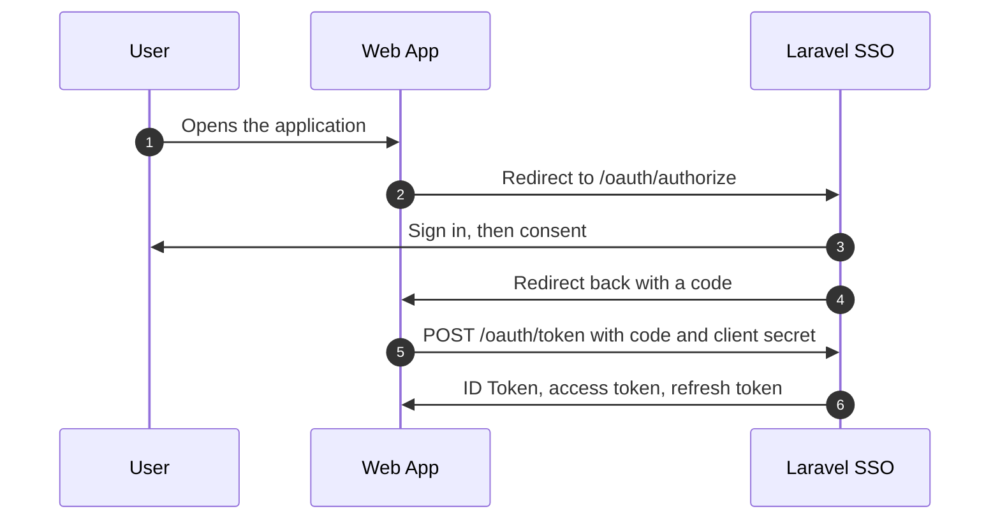
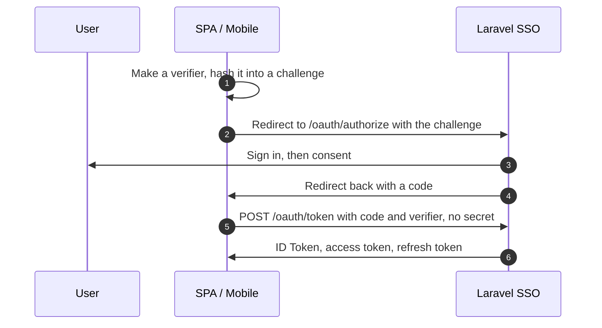
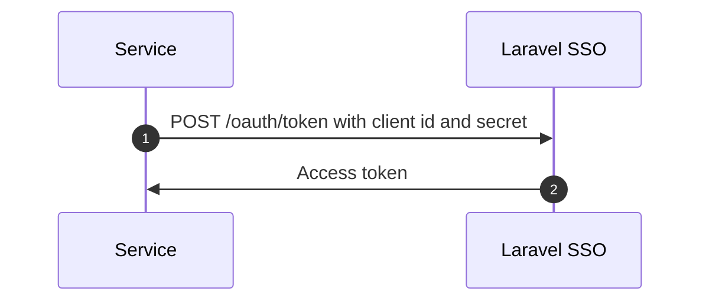

## The stack

| Layer            | What                                                        |
| ---------------- | ----------------------------------------------------------- |
| OAuth 2.0 server | Laravel Passport                                            |
| OpenID Connect   | `admin9/laravel-oidc-server`, layered on Passport           |
| Authentication   | Laravel Fortify: reset, verification, two-factor, passkeys  |
| Permissions      | `spatie/laravel-permission`                                 |
| Audit trail      | `spatie/laravel-activitylog`, with three columns of our own |
| Interface        | Inertia and Vue 3, shadcn-vue components, Tailwind 4        |
| Documentation    | Laradocs, reading the `docs/` folder you are in             |

An **Application** wraps a Passport client one-to-one. There is deliberately no
second OAuth client concept: `oauth_clients` already stores the redirect URIs,
the grant types and the disabled flag.

## How each kind of application signs in

The three types differ in one thing: how the client proves it is itself.

**Web App.** Runs on a server, so it can keep a secret.

**SPA / Mobile.** Cannot keep a secret, so PKCE takes its place. The client
proves it is the same one that started the request.

**Service.** Acts as itself. No user, no browser, and no ID Token.

## Two authorization systems

Kept separate on purpose.

**Platform permissions** decide who may administer this server. **Application
roles and permissions** describe what a user may do inside a registered
application, and are reported to it in its tokens. An administrator of this
server is not thereby an administrator of every application on it.

See [Authorization](/docs/administration/authorization).

## Where decisions live

**`app/Services`** holds the things that own a write or a rule.
`ApplicationManager` and `UserManager` own their writes and raise the events.
`AuditLogger` is the only way into the trail. `Settings` merges stored rows
over the configured defaults. `ScopeRegistry` answers what may be requested,
reading the same config the discovery document does.

**`app/Policies`** answers every authorization question. Controllers ask, and
never decide.

**`app/Concerns`** holds behaviour shared by several requests or controllers:
sorting a listing, discarding blank URI fields, resolving the application a
nested route belongs to.

**`config/sso.php`** is the operator's file: the issuer, the redirect policy,
the rate limits, and the defaults for every setting the interface can change.
`config/oidc-server.php` is the protocol surface.

## Claims are scoped to the asking client

The OIDC package resolves claims without knowing which client asked, which is
fine for name and email but not for roles and permissions. Two subclasses close
the gap: `ApplicationIdTokenService` wraps token issuance, and at `/oauth/userinfo`
the client comes from the presented token. If neither yields a client, the
authorization claims are omitted rather than guessed.

One application never learns what a user may do in another.

## Settings reach their consumers by configuration

Nothing else knows the settings table exists. `SettingsServiceProvider` copies
what an administrator chose into the keys their consumers already read:
`app.name`, `session.lifetime`, `fortify.features`, `oidc-server.tokens`,
`activitylog.clean_after_days`.

Always into the key the consumer reads, never a mirror of it: a mirror saves
cleanly and changes nothing, which is the one failure an operator cannot see.

Fortify's features are applied in `register()` rather than `boot()`, because
Fortify registers its routes while booting. That is what makes turning
registration off remove the page rather than hide a link to it.
